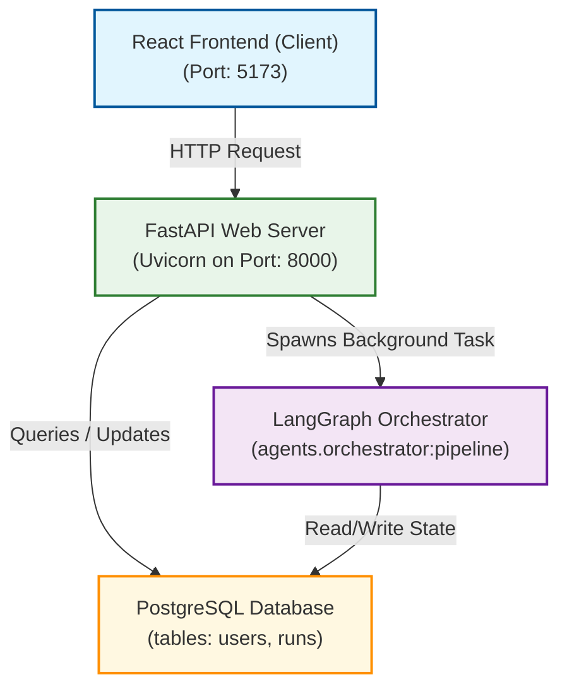
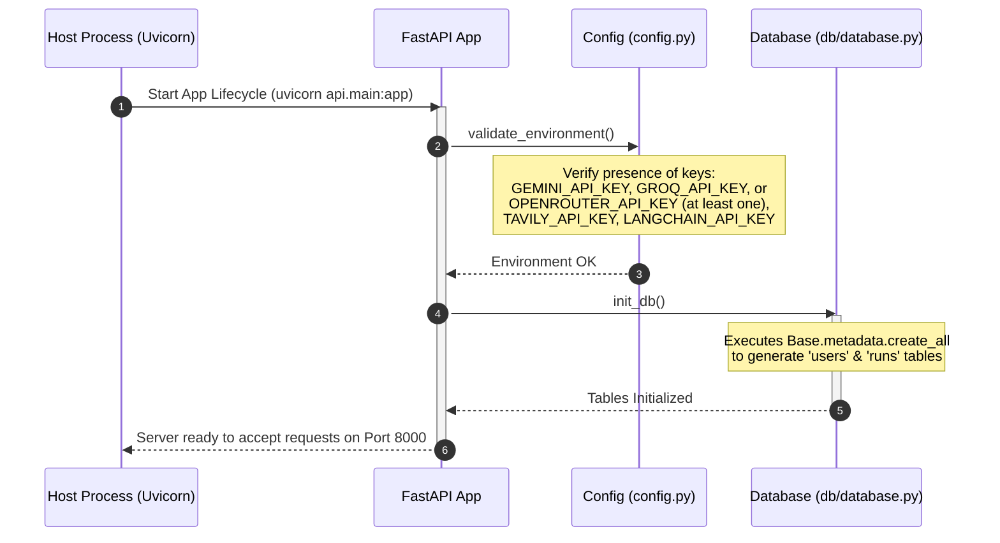
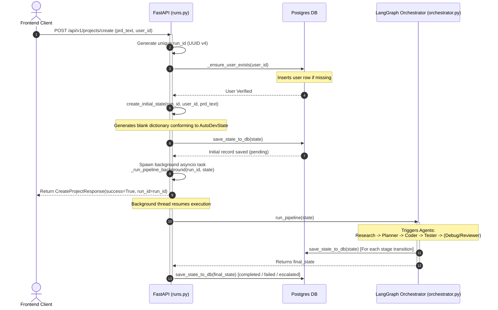
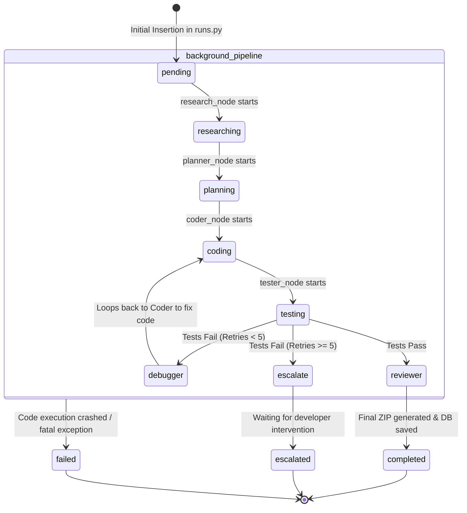

# AutoDev Backend API & Architecture Explanation

This document provides a detailed walkthrough of the backend API entry point ([main.py](file:///Users/sarv/Documents/Agentic_project/backend/api/main.py)), the endpoint routes ([runs.py](file:///Users/sarv/Documents/Agentic_project/backend/api/routes/runs.py)), the database layer, and how they orchestrate the LangGraph agentic pipeline.

---

## 1. High-Level Architecture & Lifecycle

The backend is built using **FastAPI** for high-performance async web capabilities, **SQLAlchemy** for database operations, and **LangGraph** for orchestrating a multi-agent workflow.

### ── System Component Flow ──

---

## 2. Entry Point: `main.py`

The entry point of the FastAPI application is located in [main.py](file:///Users/sarv/Documents/Agentic_project/backend/api/main.py). 

### ── Core Responsibilities of `main.py` ──

1. **Lifespan Event Management**:
   - Uses `@asynccontextmanager` to execute code during startup and shutdown.
   - **Startup**: Validates environment variables and initializes the Postgres database schema (creating tables if they do not exist).
   - **Shutdown**: Performs clean-ups (logging the shutdown sequence).
2. **App Instantiation**: Creates the FastAPI instance with platform metadata.
3. **CORS Configuration**: Adds middleware to allow cross-origin requests from the frontend developer server (e.g. `http://localhost:5173`).
4. **Route Registration**: Mounts the REST routes from `api.routes.runs` under the `/api/v1` path prefix.

### ── App Startup Lifecycle ──

---

## 3. Endpoints Layer: `routes/runs.py`

This router, located in [runs.py](file:///Users/sarv/Documents/Agentic_project/backend/api/routes/runs.py), defines the endpoints controlling project runs as outlined in the **Master Project Specification**.

### ── Request / Response Schema Models ──

The route handler uses **Pydantic** models to validate payload data and format JSON responses:
* **`CreateProjectRequest`**:
  * `prd` (str, min length: 10): The natural language software requirement.
  * `user_id` (Optional str): The client-provided user ID (defaults to `00000000-0000-0000-0000-000000000000` if anonymous).
* **`CreateProjectResponse`**:
  * `success` (bool): `True` if successfully queued.
  * `run_id` (str): UUID uniquely identifying this execution pipeline.
* **`RunStatusResponse`**:
  * `run_id` (str): Run identifier.
  * `status` (str): Current status of the run.

---

### ── Detailed Endpoint Registry ──

| Method | Path | Description | Input / Parameters | Response Schema | DB Actions |
|:---|:---|:---|:---|:---|:---|
| **POST** | `/api/v1/projects/create` | Kick off a new multi-agent pipeline | Body: `CreateProjectRequest` | `CreateProjectResponse` | Upserts `User`, registers `Run` with status `pending` |
| **GET** | `/api/v1/projects/history` | List all historical pipeline runs | None | `{"projects": [{"run_id": str, "status": str}]}` | Selects run IDs, statuses, and creation time ordered by `created_at DESC` |
| **GET** | `/api/v1/projects/{run_id}` | Fetch the current state status | Path: `run_id` | `RunStatusResponse` | Queries Run record |
| **GET** | `/api/v1/projects/{run_id}/logs` | Fetch real-time run-time logging | Path: `run_id` | `{"logs": List[str]}` | Queries logs column of Run record |
| **GET** | `/api/v1/projects/{run_id}/download` | Fetch project artifact download link | Path: `run_id` | `{"download_url": str}` | Queries `download_url` column of Run |
| **GET** | `/api/v1/health` | Health Check probe | None | `{"status": "healthy"}` | None |

---

### ── Detailed Sequence Flow of `POST /projects/create` ──

When a client submits a new project description (PRD), the following async workflow occurs:

---

## 4. The Agent Pipeline Connection

FastAPI and the LangGraph orchestrator communicate through a shared state structure called `AutoDevState` (defined in [state.py](file:///Users/sarv/Documents/Agentic_project/backend/graph/state.py)). 

### ── State Transition Diagram ──

Here is how the pipeline status transitions inside the background task from node to node:

### ── Schema Mapping between `AutoDevState` and PostgreSQL ──

When `save_state_to_db` is called, the fields in the Python `AutoDevState` dict are mapped to the columns of the `runs` table (managed in [db/models.py](file:///Users/sarv/Documents/Agentic_project/backend/db/models.py)):

* **Identity**: `run_id` ➔ `id` (PK), `user_id` ➔ `user_id` (FK to `users.id`), `prd_text` ➔ `prd_text` (Text)
* **Progress Status**: `status` ➔ `status` (String)
* **Agent Context (JSONB Columns)**:
  * `research_output` (JSONB): Web search results, tech stack notes, reference URLs.
  * `task_plan` (JSONB): File structure blueprint, implementation order.
  * `code_files` (JSONB): Complete source code dictionary `{file_path: file_content}`.
  * `test_results` (JSONB): Outcome of `pytest` execution (`passed`, `failures`, `exit_code`).
  * `review_result` (JSONB): Linter output (`Ruff`/`ESLint`), quality score.
* **Delivery & Logs**:
  * `download_url` ➔ `download_url` (presigned zip link)
  * `logs` ➔ `logs` (Postgres string Array `Text[]`)
  * `total_tokens` ➔ `total_tokens` (Int)
  * Timestamps (`created_at`, `updated_at`, `completed_at`) are computed automatically.
